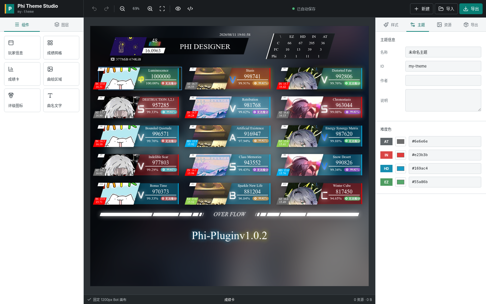

# Phi Theme Studio

[English](./README_en.md)

基于 [GrapesJS](https://github.com/GrapesJS/grapesjs) 的 phi-plugin 可视化主题包编辑器。从浏览器中的查分结果画布直接生成可安装的主题 ZIP，不需要手写 `info.yaml`。

在线编辑器：[https://lyh2011.github.io/phi-theme-studio/](https://lyh2011.github.io/phi-theme-studio/)

第一次使用请看 [使用指南](./docs/使用指南.md)，或直接点编辑器右上角的问号按钮。



## 功能

- B19、B27、B30、B33（Overflow）及 B30 数据分析五种成绩图状态
- 每日签到、存档更新、课题模式、Arcaea 风格 B19、推分建议、定数表、成绩列表、B30 历史、插件设置、用户设置、定数历史和帮助页面的独立可视化 CSS 编辑
- 「可选元素」开关可显示版本提示、平均 ACC、定数对比、无成绩占位、标签数据不足与宽版直方图等条件区块，它们在 phi-plugin 中只对特定存档或插件设置渲染
- GrapesJS 语义元素选择与拖动，修改会生成 phi-plugin 运行时可用的稳定选择器 CSS
- 左栏组件索引覆盖玩家信息、成绩卡、条件元素与数据分析，支持按名称或选择器搜索
- 画布支持最高 300% 缩放，放大后可按住鼠标右键平移；工具栏支持缩放与自动适应画布
- 语义元素和自定义元素均可拖动、调整宽高，拖动距离会按当前画布缩放精确换算；按住 `Shift` 拖动可临时关闭自动对齐
- 选中元素后可用方向键微调位置，按住 `Shift` 每次移动 10px
- 缩放手柄位于选区外侧，只有十几像素高的文字元素也能直接拖动，不会误触缩放
- 右侧面板支持布局、文字、外观、变换以及 SVG `fill`、`stroke` 编辑；任意元素可叠加图片、纯色或渐变背景，并分别调整四角圆角和整体透明度
- 样式面板标题栏显示元素层级面包屑（点击可选回上层容器）、当前导出选择器与覆盖数量，可一键清除该元素的全部覆盖
- 所有样式设置项都会显示当前元素的计算默认值；默认值只作参考，不会写入覆盖 CSS 或导出包
- 字号、宽高、位置等数值控件默认使用 `px`，旋转默认使用 `deg`，也可在控件中切换单位或直接输入完整 CSS 值
- 多维度雷达图、标签排行、直方图等数据分析元素定制
- 可点击或从左栏拖放文字、矩形、圆形、三角形、线条，也可上传图片作为画布元素
- 预览默认使用 phi-plugin 的 PHI 字体，自定义主题字体可覆盖它
- 主题名称、ID、作者、说明及四难度色配置，难度色实时应用到预览
- 背景、字体和九种评级图标资源管理
- 导入旧版单页或新版多页面 phi-plugin 主题 ZIP
- 导出可直接解压到 `resources/html/b19/themes/` 的多页面主题 ZIP，B19 样式表可选「覆盖模式」或「自包含模式」
- `studio.json` v2 分页保存 CSS 与可编辑配置，ZIP 可再次导入并恢复各页面状态
- IndexedDB 本地自动保存、撤销/重做、源码高级模式
- 资源路径、CSS、ZIP Slip、文件数量和大小校验
- 不可信 `studio.json` 脚本拦截与 ZIP 解压大小限制
- 桌面与移动端工作台布局

## 使用

```bash
npm install
npm run dev
```

开发服务器默认运行于 `http://localhost:5173`。

1. 新建主题，或通过顶部“导入”载入已有 ZIP。
2. 在第一行页面标签中选择要编辑的 phi-plugin 页面；B19 页面还可在第二行切换五种结果状态。选择或拖动语义元素后，通过右侧“样式”面板编辑布局、尺寸、颜色与外观；“外观 > 背景”可为任意元素上传图片或设置渐变、圆角和透明度。
3. 需要给条件区块配色时，在预览栏的“可选元素”中勾选对应状态，元素出现在画布后即可正常选中与编辑。
4. 画布放大后，按住鼠标右键拖动以查看超出工作区的区域；点击缩放百分比或“适应画布”可重新居中。
5. 在左侧“组件”中搜索元素名或选择器快速定位；“自定义元素”区域可添加文字或基础图形，选择“上传图片”可把本地素材加入画布。
6. 在“主题”和“资源”中配置元数据、颜色、背景、字体与图标。
7. 在“导出”中选择样式表形态（覆盖 / 自包含），通过校验后生成 ZIP。
8. 将 ZIP 解压到 phi-plugin 的 `resources/html/b19/themes/`。
9. 使用 `/myset 主题 <ID>` 选择主题。

## 导出结构

```text
my-theme/
├── info.yaml
├── b19.css
├── pages/
│   ├── sign-sign.css
│   ├── setting-userSetting.css
│   └── ...                 # 每个独立页面的 CSS 覆盖层
├── b19.art                 # 添加画布自定义元素或使用高级模板时生成
├── studio.json
└── assets/
    ├── background.webp
    ├── font.woff2
    ├── custom/             # 上传到画布的自定义图片
    │   └── image.png
    ├── elements/           # 元素背景图片
    │   └── background.png
    └── rating/
        ├── FC.png
        └── phi.png
```

### 样式表形态

在「导出」面板可以选择 `b19.css` 的两种形态，两者在 phi-plugin 中渲染结果一致，区别只在于 B19 基础样式从哪里来。`pages/` 中的其它页面样式始终作为插件原页面 CSS 之上的覆盖层加载。

**覆盖模式（默认）** 只保存你改动的规则，其余样式由 phi-plugin 当前版本提供：

```css
@import "../../b19.css";
```

包很小，上游修复基础样式时主题会自动跟进；代价是上游若调整 `b19.css` 结构，主题外观可能随之变化。

**自包含模式** 把基础样式一并写进主题包，与插件内置的 `milthm` 主题一致：

```css
@import "../../../common/common.css";

/* phi-theme-studio:base-styles:start */
/* ...phi-plugin 基础样式... */
/* phi-theme-studio:base-styles:end */
```

外观被固定下来，不受上游改动影响；代价是拿不到上游改进，需要时得重新导出。生成的基础样式块带有标记注释，再次导入时会被剥离，编辑器里仍然只显示你自己的覆盖规则。

B19 五种状态共用 `b19.css`；其它页面各自保存独立 CSS，切换页面不会混入上一页的规则。`studio.json` v2 记录分页工程状态和所选样式形态，phi-plugin 会忽略该文件；旧版 v1 单页主题仍可导入。

难度色、主题字体和背景不写入 CSS——phi-plugin 会依据 `info.yaml` 在 `common/layout/default.art` 中注入 `:root { --AT/--IN/--HD/--EZ }` 与 `@font-face`，所以它们不出现在 `b19.css` 里是正常的。

画布中新增的文字、图形和图片会同时保存在 `studio.json`，并注入导出包内真实的 `b19.art`，因此 phi-plugin 渲染结果会包含这些元素。上传图片会写入 `assets/custom/`，模板通过 `{{themeInfo.baseUrl}}` 引用包内路径。此时 `info.yaml` 会自动包含 `template: b19.art`。

## 高级模板

在 B19 页面中，“源码”面板支持保留或编辑现有主题的 `b19.art`。一旦内容非空，导出包会包含 `template: b19.art` 并覆盖插件内置模板。没有手写模板但添加了画布自定义元素时，编辑器会以 phi-plugin 的真实模板为基础自动生成 `b19.art`。其它页面由插件提供 ArtTemplate，只开放 CSS 覆盖编辑。

ArtTemplate 包含 `{{each}}`、`{{if}}` 等运行时语句，不能安全地通过 GrapesJS HTML 解析器往返处理。因此可视化画布只编辑展开后的固定预览结构和 CSS；手写或导入的控制流仍作为不透明源码保存，编辑器只在导出时向其中追加画布自定义元素。

## 校验边界

- 导出 ID 必须匹配 `^[a-z][a-z0-9_-]*$`
- 禁止与 `default`、`snow`、`star`、`dss2`、`topText`、`foolsDay` 冲突
- ZIP 顶层目录自动与主题 ID 保持一致
- 资源路径禁止绝对路径、`..`、反斜杠、协议 URL、query 和 hash
- CSS 禁止远程 `@import`、`javascript:` 和不安全资源 URL
- 单个资源不超过 20 MB，主题 ZIP 不超过 50 MB，最多 128 个文件

自定义 `b19.art` 属于可信管理员代码。安装第三方模板前仍需进行代码审查。

## 开发命令

```bash
npm run typecheck
npm run lint
npm test
npm run test:pages
npm run build
```

GitHub Pages 构建可通过 `VITE_BASE_PATH` 指定部署子路径：

```bash
VITE_BASE_PATH=/phi-theme-studio/ npm run build
```

## 技术栈

- React 19 + TypeScript + Vite
- GrapesJS 0.23
- JSZip + YAML
- PostCSS + postcss-value-parser
- IndexedDB（idb-keyval）
- Vitest + Playwright

## 许可证

本项目采用 [GPL-3.0](./LICENSE)。预览结构、基础样式与演示资源派生自 [Catrong/phi-plugin](https://github.com/Catrong/phi-plugin)，详见 [NOTICE](./NOTICE)。GrapesJS 本身采用 BSD-3-Clause 许可证。
